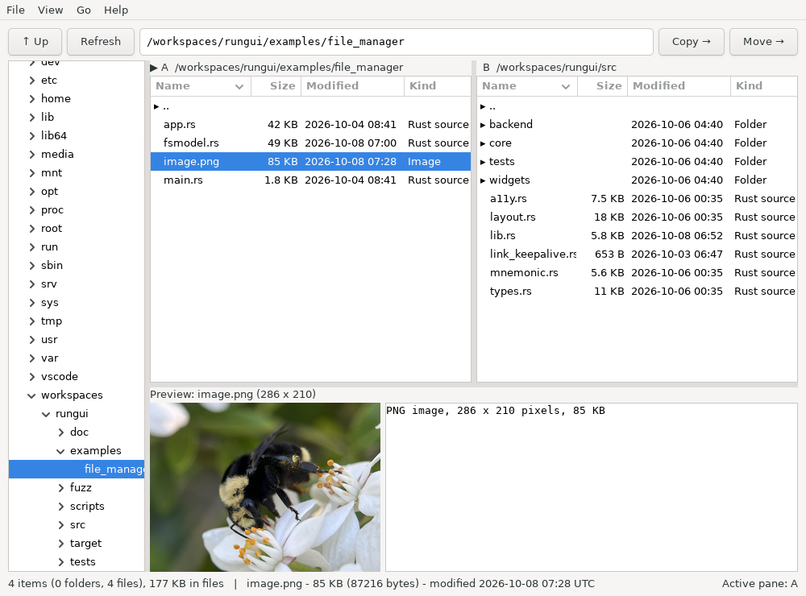
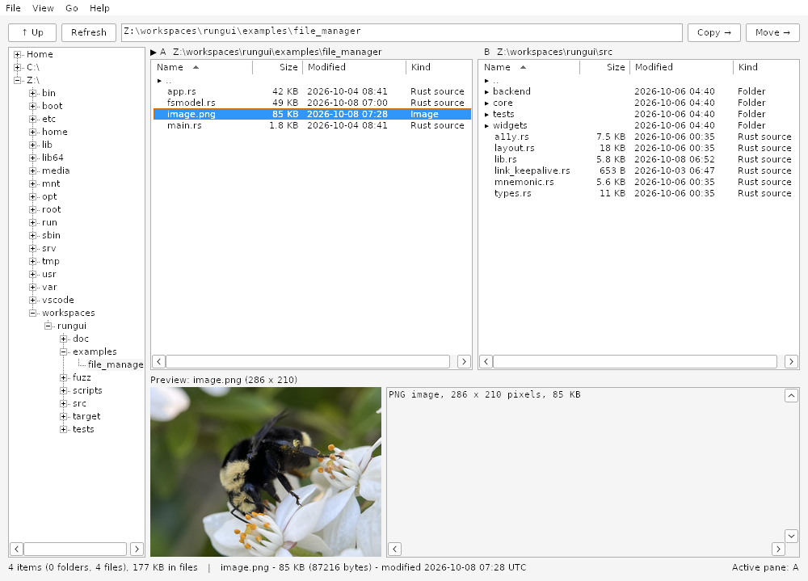
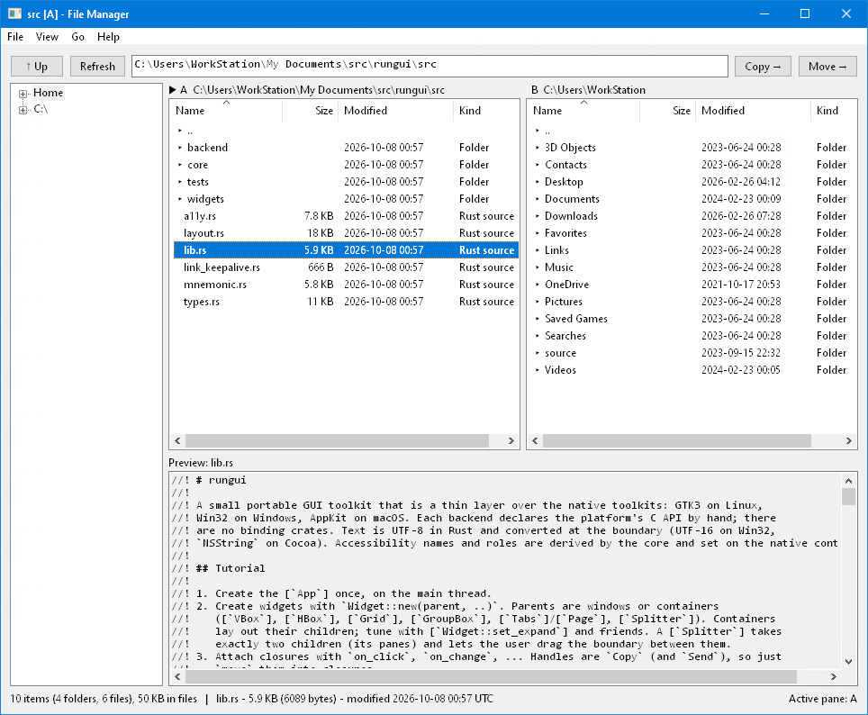
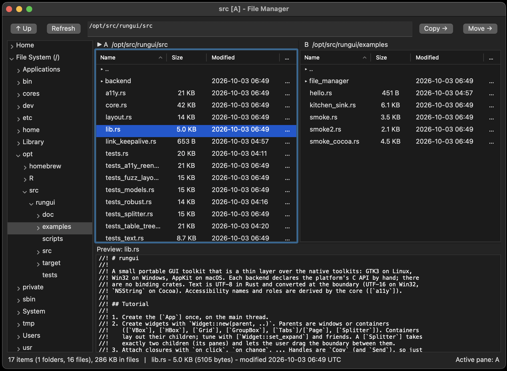
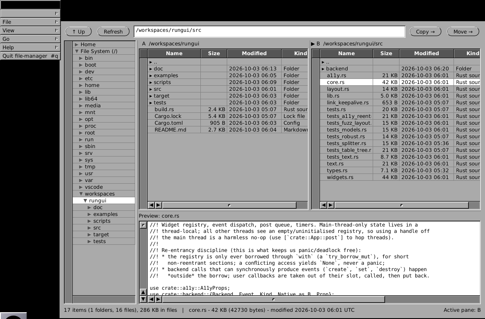

# rungui — Rust Unified Native GUI

## LLM notice

This repository is written by an LLM.

If LLM code is a no-go for you, close the tab and move on.

I believe it's basically okay and have lightly reviewed, tested and fuzzed it a
fair bit. But, you know, LLM code. Caveat emptor.

## Overview

Rungui is a small (15kloc) portable desktop GUI library built as a wrapper over
GTK3 (Linux), Win32 (Windows) and Cocoa (macOS). It has no other Rust
dependencies and builds in seconds. The style is old-fashioned stateful objects
with callbacks. There are no advanced Rust features used, just `Copy` integer
IDs for object handles that go inert when the underlying native object is
destroyed or used out of valid context.

## Quickstart

```rust
use rungui::*;

fn main() {
    let app = App::new("hello").expect("init");
    let win = Window::new("Hello, rungui");
    let col = VBox::new(win);
    let label = Label::new(col, "Hello, wörld!");
    let name = TextInput::new(col);
    let button = Button::new(col, "Greet");
    button.on_click(move || label.set_text(&format!("Hello, {}!", name.text())));
    win.show();
    app.run();
}
```

```
cargo run --example hello          # Linux needs libgtk-3-dev
cargo run --example kitchen_sink   # every widget
cargo run --example file_manager   # dual-pane file manager
cargo run-mac --example kitchen_sink   # Cocoa backend on GNUstep (Linux)
cargo run-win --example kitchen_sink   # Win32 backend under wine (x86_64 Linux)
cargo doc --open                   # tutorial + API
```

Containers: `VBox`, `HBox`, `Grid`, `GroupBox`, `Tabs`/`Page`, `Splitter`.

Widgets: `Label`, `Button`, `CheckBox`, `RadioButton`, `TextInput`, `TextArea`, `ComboBox`, `ListBox`, `Slider`, `SpinBox`, `ProgressBar`, `Image`, `Table`, `Tree`, `Menu`, `MenuBar`, `MenuItem`, `PopupMenu`, `message_box`, `FileDialog`, `Timer`.

## Example screenshots

`examples/file_manager` is a dual-pane file manager, about 2kloc, nothing platform specific.

**GTK3 (Linux)**



**Win32 (Wine)**



**Win32 (Windows 10)**



**Cocoa (macOS)**



**Cocoa (GNUstep)**



 See [`doc/STATUS.md`](doc/STATUS.md). 

## Dependencies

**Rust crates.** None:

**Native libraries.** What gets linked is decided in `build.rs`:

| Target | Links against | Install |
|---|---|---|
| Linux (GTK3) | libgtk-3, gdk-3, gdk_pixbuf, pango, cairo, atk, gio, gobject, glib | `apt install libgtk-3-dev pkg-config` |
| Windows | user32, gdi32, kernel32, comctl32, comdlg32, shell32, ole32, uxtheme, dwmapi, shcore, oleacc, uiautomationcore, imm32 (all part of Windows) | nothing |
| macOS | AppKit, Foundation, CoreGraphics, libobjc (all part of macOS) | Xcode command line tools |
| Linux, `--features emulate-mac` | libgnustep-gui, libgnustep-base, libobjc (GCC runtime) | `apt install gnustep-devel libgnustep-gui-dev libobjc-14-dev gobjc clang` |

**Only for testing and cross-building on Linux** (all installed by `scripts/setup-devcontainer.sh`):
`xvfb xauth xdotool x11-utils imagemagick` (headless GUI smoke tests and screenshots),
`gcc-mingw-w64-x86-64 binutils-mingw-w64-x86-64` plus the rustup target `x86_64-pc-windows-gnu`
(Windows builds), `wine wine64` (x86_64 hosts only; runs them), and the rustup targets
`aarch64-apple-darwin` and `x86_64-apple-darwin` (type-checking the real macOS backend).

## Binary sizes

Plain `cargo build --release`:

| Binary | GTK3 built | GTK3 stripped | Cocoa built | Cocoa stripped | Cocoa built | Cocoa stripped | Win32 built | Win32 stripped |
|---|---|---|---|---|---|---|---|---|
| `hello` | 756 KiB | **601 KiB** | 803 KiB | **663 KiB** | 873 KiB | **711 KiB** | 1,738 KiB | **1,266 KiB** |
| `file_manager` | 1,092 KiB | **862 KiB** | 1,087 KiB | **884 KiB** | 1,173 KiB | **939 KiB** | 1,964 KiB | **1,427 KiB** |

Per-widget, per-platform status is in
[`doc/STATUS.md`](doc/STATUS.md). `scripts/check-all.sh` builds and tests every mode; see
[`doc/BUILDING.md`](doc/BUILDING.md) and [`doc/DESIGN.md`](doc/DESIGN.md).

## Known limits

See "Known gaps" in [`doc/STATUS.md`](doc/STATUS.md).

## License

ASL2/MIT at your option

## Contributing

I want to keep this thing very small and simple. Bug reports or fixes welcome. I
intend to shake bugs out of it until it feels stable and then call it 1.0 and
mostly leave it be. Beyond that, if you have big ambitions probably best to
fork. It is a small codebase bridging to stable native APIs that never change.
It was synthesized in 3 hours on a cheap model. It shouldn't really require much
extension or maintenance.